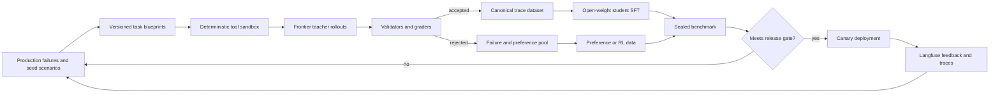

# The Crunch Research Loop

**Status:** Active plan  
**Goal:** Benchmark a frontier teacher and smaller open-weight students on the same
restaurant-concierge tasks, capture reproducible agent traces, and use verified
teacher trajectories to improve a student without weakening reliability.

## Research claim

The project should eventually support this evidence-backed claim:

> On a sealed restaurant-concierge evaluation set, an open-weight student reaches
> an agreed fraction of a frontier teacher's task success while preserving tool
> reliability and grounding, at lower inference cost or latency.

That claim requires more than comparing final prose. The benchmark must exercise
the real agent loop and record messages, tool calls, tool observations, failures,
cost, latency, and grader outputs.

## Current state

The repository already has:

- A TypeScript agent loop in `src/AnthropicChatBot.ts`.
- Anthropic-compatible inference through Anthropic, DeepSeek, or OpenRouter.
- Three tools: date resolution, Exa search, and Mapbox geocoding.
- Langfuse tracing through OpenTelemetry/OpenInference.
- Eight single-turn regression cases and deterministic graders.
- A manually triggered eval workflow.

The current eval is not yet a production-faithful benchmark:

- It invokes one model turn directly instead of the complete agent loop.
- It sees requested tool calls but does not execute tools.
- It cannot evaluate search-then-geocode sequencing or grounded final answers.
- Tool responses are not frozen, so a live-tool comparison would not be reproducible.
- The committed report contains authentication failures rather than a valid baseline.
- The initial manifest/trace foundation now pins dataset, prompt, code, and provider;
  tool-fixture versioning remains part of the production-faithful harness phase.

## Target loop



## Requirements

### R1 — One runtime

Production and evaluation must invoke the same orchestration code. Provider
selection, prompt assembly, tool schemas, tool-loop limits, and message conversion
must not have separate implementations.

### R2 — Deterministic tool replay

The harness must support:

- `fixture`: frozen Exa, Mapbox, and date results for CI and model comparison.
- `live`: read-only APIs for drift checks and collecting new snapshots.
- `fault`: deterministic timeouts, rate limits, malformed responses, empty results,
  and partial geocoding.

Every tool observation must include a fixture or snapshot version. Models in a
comparison receive identical observations.

### R3 — Canonical traces

Each trial must use a provider-neutral, versioned envelope containing:

- Scenario ID, taxonomy, split, seed, and hidden constraints.
- Model, provider, prompt hash, toolset hash, and code revision.
- Ordered user, assistant, tool-call, tool-result, and error events.
- Latency, token usage, estimated cost, stop reason, and tool rounds.
- Deterministic and model-grader scores.
- Acceptance state, rejection reasons, and lineage.

Do not require or store hidden chain-of-thought. Train only on observable assistant
messages and actions. Tool observations remain context but receive no training loss.

### R4 — Dataset isolation

Use distinct datasets:

1. `development`: inspectable cases used while building graders.
2. `regression`: production failures that must never recur.
3. `capability-holdout`: unseen restaurants, neighborhoods, scenario templates,
   and tool snapshots.
4. `sealed-live`: temporally fresh cases used only for release decisions.
5. `training`: accepted synthetic and production-derived trajectories.

Splits must be grouped by restaurant identity, scenario template, geography, and
tool snapshot—not random transcript rows.

### R5 — Model comparison

Every benchmark run must:

- Run the same dataset and fixtures for every model.
- Record at least three trials for stochastic reliability once the full loop exists.
- Report per-capability scores, `pass@k`, `pass^k`, latency, tokens, and cost.
- Preserve complete traces for failed trials.
- Compare against a named baseline run rather than only an absolute threshold.

### R6 — Layered grading

Use hard validators before subjective judges:

1. Tool schema and argument validity.
2. Required/forbidden tool selection and sequence.
3. Hard constraint satisfaction.
4. Restaurant provenance against tool observations.
5. Geocode coverage and neighborhood consistency.
6. Unsupported-claim rate.
7. Planning-stage adherence.
8. Human-calibrated model judge for relevance, usefulness, and tone.

A high prose-quality score cannot override a hard grounding or tool-execution
failure.

### R7 — Training export

Accepted traces must export to:

- Provider-neutral JSONL for archival and analysis.
- OpenAI-style tool-call messages for common open-model trainers.
- Tinker renderer input through a separate Python training workspace.
- Chosen/rejected pairs at the same conversation state for preference training.

Environment/tool messages are masked from loss. Failed actions are not included as
SFT targets; they may be retained as rejected preference examples.

### R8 — Privacy, provenance, and licensing

- Redact user identifiers and free-text PII before dataset promotion.
- Record source and license for restaurant/review content.
- Store URLs and short evidence snippets rather than copying full reviews.
- Respect teacher-model terms before using outputs for training.
- Maintain generator prompt hashes and parent-trace lineage.
- Keep sealed eval data out of teacher-generation and training inputs.

## Trace generation strategy

More volume is useful only after traces are executable and gradeable. Use four
sources in order of signal:

### 1. Production-derived cases

Convert thumbs-down traces, tool errors, abandoned conversations, and sampled normal
traffic into redacted scenarios. Preserve the exact failure as regression data, then
generate nearby variants for training.

### 2. Compositional scenario blueprints

Create symbolic blueprints from:

- Intent: discover, verify, compare, plan an itinerary.
- Disclosure stage: vague request, anchor chosen, vibe supplied, plan ready.
- Constraints: cuisine, budget, dietary need, distance, occasion, date.
- Geography: NYC neighborhood, non-NYC, ambiguous place name.
- Tool state: success, no result, stale result, conflict, timeout, rate limit.
- Behavior boundary: call tool, do not call tool, or ask for clarification.

Code owns the hidden truth and expected milestones. An LLM may naturalize the user's
language but must not invent the underlying state.

### 3. Teacher sampling with rejection

For each blueprint:

1. Execute multiple frontier-teacher rollouts against the sandbox.
2. Validate tool JSON and actually execute every call.
3. Check hard constraints, grounding, and final state.
4. Use an independent critic only for subjective dimensions.
5. Retain a clean success and, optionally, a verified recovery trace.
6. Store useful failures as preference candidates.

### 4. Student-targeted generation

After the first student baseline, oversample capability cells where the student
fails but the teacher succeeds. Keep a fixed broad distribution so training does not
overfit only the latest failure.

## Training sequence

### Stage A — Prompt and retrieval baseline

Before training, test whether the student gap closes with:

- Better tool descriptions and output schemas.
- Frozen restaurant evidence supplied through retrieval.
- Source-aware response formatting.
- A concise decision policy in the system prompt.

Restaurant facts should remain in tools/RAG because hours, openings, and reviews
change. Train the policy for when and how to retrieve, not a static restaurant
catalog.

### Stage B — Supervised fine-tuning

Train on accepted teacher trajectories:

```text
system
user
assistant tool_call       <- train
tool observation          <- context only
assistant tool_call       <- train
tool observation          <- context only
assistant final response  <- train
```

Start with SFT because it directly teaches tool syntax, sequencing, clarification,
and grounded response structure.

### Stage C — Preference optimization

Use DPO only after collecting aligned chosen/rejected actions at the same state.
Useful ranking:

```text
correct grounded action
> appropriate clarification
> honest no-result response
> wrong tool or arguments
> fabricated tool result
```

### Stage D — Verifiable RL

Consider GRPO/RLVR only when the sandbox has trustworthy scalar rewards for tool
validity, arguments, hard constraints, grounding, and efficiency. Subjective
restaurant taste should remain a preference or judge signal.

## Tinker decision

Tinker is viable later, not as an application dependency:

- It exposes Python APIs for LoRA SFT, DPO, distillation, and RL while managing GPUs.
- Its renderers support tool-call conversations and per-token loss masks.
- The TypeScript application must export canonical traces to a separate Python
  training workspace.
- Its inference endpoint is suitable for evaluation/internal traffic, not the
  assumed production serving layer.

**Decision:** keep Tinker behind a training-adapter boundary. First produce a clean
JSONL corpus and one student baseline. Then compare Tinker with managed tool-call
fine-tuning and TRL/Axolotl based on cost, model support, deployment needs, and the
amount of algorithmic control desired.

## Langfuse versus LangSmith

**Decision:** use Langfuse as the system of record now.

The current Anthropic SDK is already instrumented with OpenInference and
OpenTelemetry into Langfuse. Langfuse supports datasets, experiment runs,
TypeScript evaluators, annotation queues, corrected outputs, prompt versions, and
scores. Adding LangSmith now would duplicate traces and datasets without teaching
LangChain itself.

LangSmith does not require LangChain and can ingest the same OpenTelemetry spans. If
a later LangGraph project or team requirement justifies it, fan out through an
OpenTelemetry Collector. Do not double-wrap Anthropic calls, which would create
duplicate spans.

## Delivery phases and gates

### Phase 0 — Reproducible artifacts

Deliver:

- Canonical `agent-trace.v1` and `eval-run.v1` contracts.
- Prompt, dataset, code, and model metadata in every run manifest.
- Multi-model configuration through one eval command.
- Versioned JSON/JSONL artifacts while retaining the current HTML report.

Exit gate: a run can be reproduced from its manifest, and failures retain traces.

### Phase 1 — Production-faithful harness

Deliver:

- Shared production/eval runtime.
- Fixture/live/fault tool adapters.
- Multi-turn cases and tool-sequence graders.
- Langfuse dataset experiment linkage.

Exit gate: frontier and open models run the same complete loop over identical tool
observations.

### Phase 2 — Baseline benchmark

Deliver:

- 20–50 reviewed tasks, starting with real failures and decision boundaries.
- Frontier teacher plus at least two open-weight candidates.
- Three or more trials where reliability matters.
- Scorecard by capability, cost, and latency.

Exit gate: graders explain observed wins/losses when transcripts are manually
audited.

### Phase 3 — Trace factory

Deliver:

- Blueprint compiler and symbolic user state.
- Deterministic tool sandbox and failure injection.
- Teacher sampling, validation, rejection, deduplication, and coverage reports.
- Immutable training and holdout dataset releases.

Exit gate: every accepted training trace executes successfully and has provenance.

### Phase 4 — Student improvement

Deliver:

- Prompt/RAG baseline.
- SFT adapter and first open-weight checkpoint.
- Optional preference optimization based on measured residual failures.
- Re-run of the untouched sealed benchmark.

Exit gate: the student meets the agreed equivalence gate without regressing critical
tool or grounding metrics.

### Phase 5 — Production learning loop

Deliver:

- Canary routing.
- User feedback and trace sampling in Langfuse.
- Failure promotion workflow into regression and training pools.
- Drift and cost dashboards.

Exit gate: production evidence agrees with offline rankings closely enough to make
model promotion decisions.

## Proposed equivalence gate

Confirm or revise after the first valid baseline:

- No critical tool-schema, fabricated-observation, or grounding regression.
- At least 95% of teacher score on deterministic capability metrics.
- No more than five percentage points below the teacher on human-calibrated quality.
- Better cost or latency on the intended serving hardware.
- Report `pass^3`; do not accept a student based on one lucky trial.

## Immediate implementation order

1. Add canonical run and trace artifacts to the existing eval without pretending it
   is a full-loop benchmark.
2. Add model-matrix support and produce a valid frontier/open baseline.
3. Extract one shared agent runtime and injectable tools.
4. Build 20–50 reviewed multi-turn tasks and fixtures.
5. Connect Langfuse datasets/experiments and annotation queues.
6. Build the trace factory.
7. Choose a student/trainer only after the benchmark identifies the gap.

## Primary references

- [Anthropic: Demystifying evals for AI agents](https://www.anthropic.com/engineering/demystifying-evals-for-ai-agents)
- [APIGen-MT: verified blueprints and multi-turn simulation](https://arxiv.org/abs/2504.03601)
- [Agent Distillation: interactive tool trajectories](https://arxiv.org/abs/2505.17612)
- [DeepSeek-R1: rejection sampling and small-model distillation](https://arxiv.org/abs/2501.12948)
- [Tülu 3 / Open Instruct post-training recipe](https://arxiv.org/abs/2411.15124)
- [Tinker documentation](https://tinker-docs.thinkingmachines.ai/)
- [Langfuse experiments](https://langfuse.com/docs/evaluation/experiments/experiments-via-sdk)
- [Langfuse annotation queues](https://langfuse.com/docs/evaluation/evaluation-methods/annotation-queues)
- [LangSmith OpenTelemetry tracing](https://docs.langchain.com/langsmith/trace-with-opentelemetry)
- [LangSmith TypeScript evaluation](https://docs.langchain.com/langsmith/evaluate-llm-application)
