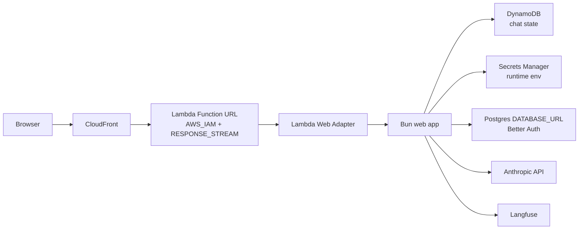

# Serverless Migration Plan

## Current Architecture

The Crunch currently runs as a Bun container on EC2:

- GitHub Actions builds and pushes an ECR image.
- The workflow SSHes into EC2 and runs `docker run`.
- The app serves React assets and API routes from `Bun.serve()`.
- `/api/chat/send` streams newline-delimited JSON over `text/event-stream`.
- Better Auth uses Postgres through `pg`.
- Chat conversations were stored in Supabase through the `IDatabase` interface.
- The existing CDK stack only scheduled EC2 start/stop; it did not own the web app.

## Evaluated Options

### Lambda Web Adapter + DynamoDB

This is the implemented AWS-first serverless target.

- Bun continues to run as the HTTP server.
- Lambda Web Adapter translates Function URL requests into HTTP requests for Bun.
- Function URL uses `RESPONSE_STREAM` for chat streaming.
- CloudFront signs origin requests with origin access control, so the Function URL uses AWS IAM auth instead of being directly public.
- DynamoDB stores chat conversations and messages.
- CloudFront fronts the Function URL.
- Secrets are stored in AWS Secrets Manager and loaded at runtime.
- Langfuse traces Anthropic calls through OpenTelemetry instrumentation.

This keeps the chat runtime outside a VPC, which matters because Lambda Function URLs do not support response streaming for VPC-attached functions.

### Lambda + Aurora Serverless v2

Aurora Serverless v2 is attractive because it can now scale to 0 ACUs for compatible engine versions, but it is not the first migration target for this app.

The blocker is the combination of:

- chat streaming through Lambda Function URLs,
- private Aurora access through VPC networking,
- Better Auth's direct `pg.Pool` Postgres connection model.

Putting Lambda in a VPC to reach Aurora would break the Function URL streaming path. Aurora can still be a later auth/database target, but it likely pairs better with App Runner/Fargate or with a larger auth rewrite.

### App Runner or Fargate + Aurora

This is the best managed-container fallback if SQL auth becomes the priority.

It preserves the current container and long-running HTTP behavior with fewer Lambda-specific constraints. The tradeoff is that it is less scale-to-zero than Lambda + DynamoDB and may keep a warm service around.

### Cloudflare

Cloudflare Workers + D1/KV/R2 would be very maintainable and inexpensive, but it would push the project away from AWS and require more runtime adaptation for Bun/server-side dependencies.

## Chosen Plan

Use Lambda Web Adapter + DynamoDB for the first serverless migration.

This removes the always-on EC2 host while preserving:

- the Bun app structure,
- the current streaming chat UX,
- the existing container artifact,
- the small `IDatabase` persistence boundary.

Better Auth remains Postgres-backed through `DATABASE_URL` for now. The next AWS-native auth step should be either Cognito or a managed-container Aurora path; doing that at the same time as the compute migration would mix two hard migrations.

## Deployment Shape

## Follow-Up Work

- Refresh AWS auth and run the GitHub Actions deploy or local CDK deploy.
- Rotate any local secret values that were present during early synth attempts.
- Verify chat streaming through the CloudFront URL.
- Decide whether auth should move to Cognito, DynamoDB-backed sessions, or App Runner + Aurora Serverless v2.
