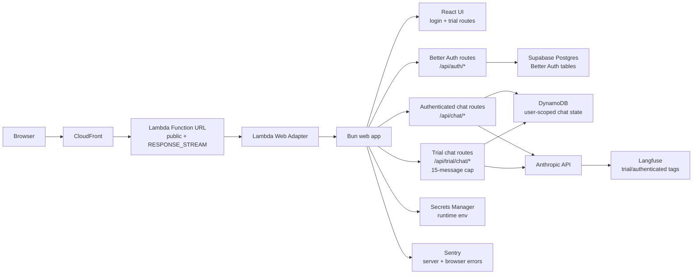

# Serverless Migration Plan

## Current Architecture

The Crunch has been migrated away from the always-on EC2 deployment path. The
target runtime is now AWS serverless:

- GitHub Actions builds and pushes an ECR image.
- CDK deploys a Lambda container function with Lambda Web Adapter.
- CloudFront fronts the Lambda Function URL.
- The app serves React assets and API routes from `Bun.serve()`.
- `/api/chat/send` streams newline-delimited JSON over `text/event-stream`.
- Chat conversations are stored through the `IDatabase` interface. Production
  serverless uses DynamoDB; local/dev can still use `local` or Supabase.
- Better Auth uses Postgres through `pg` and `DATABASE_URL`.
- Runtime secrets are stored in AWS Secrets Manager.
- Anthropic calls are traced to Langfuse when server-side Langfuse env vars are
  present.

The old EC2 deployment path was:

- The workflow SSHes into EC2 and runs `docker run`.
- The existing CDK stack only scheduled EC2 start/stop; it did not own the web app.

## Evaluated Options

### Lambda Web Adapter + DynamoDB

This is the implemented AWS-first serverless target.

- Bun continues to run as the HTTP server.
- Lambda Web Adapter translates Function URL requests into HTTP requests for Bun.
- Function URL uses `RESPONSE_STREAM` for chat streaming.
- CloudFront fronts a public Lambda Function URL. This intentionally exposes the app to the public internet while the application's own Better Auth routes protect user workflows. The Lambda resource policy grants both `lambda:InvokeFunctionUrl` and `lambda:InvokeFunction` for Function URL requests, which the newer Lambda URL auth model requires.
- DynamoDB stores chat conversations and messages.
- CloudFront fronts the Function URL.
- Secrets are stored in AWS Secrets Manager and loaded at runtime.
- Langfuse traces Anthropic calls through OpenTelemetry instrumentation.

This keeps the chat runtime outside a VPC, which matters because Lambda Function URLs do not support response streaming for VPC-attached functions.

### Lambda + Aurora Serverless v2

Aurora Serverless v2 is attractive because it can now scale to 0 ACUs for compatible engine versions, but it is not the first migration target for this app.

The blocker is the combination of:

- chat streaming through Lambda Function URLs,
- private Aurora access through VPC networking,
- Better Auth's direct `pg.Pool` Postgres connection model.

Putting Lambda in a VPC to reach Aurora would break the Function URL streaming path. Aurora can still be a later auth/database target, but it likely pairs better with App Runner/Fargate or with a larger auth rewrite.

### App Runner or Fargate + Aurora

This is the best managed-container fallback if SQL auth becomes the priority.

It preserves the current container and long-running HTTP behavior with fewer Lambda-specific constraints. The tradeoff is that it is less scale-to-zero than Lambda + DynamoDB and may keep a warm service around.

### Cloudflare

Cloudflare Workers + D1/KV/R2 would be very maintainable and inexpensive, but it would push the project away from AWS and require more runtime adaptation for Bun/server-side dependencies.

## Chosen Plan

Use Lambda Web Adapter + DynamoDB for the first serverless migration.

This removes the always-on EC2 host while preserving:

- the Bun app structure,
- the current streaming chat UX,
- the existing container artifact,
- the small `IDatabase` persistence boundary.

Better Auth remains Postgres-backed through `DATABASE_URL` for now. The next AWS-native auth step should be either Cognito or a managed-container Aurora path; doing that at the same time as the compute migration would mix two hard migrations.

## Review Status

This is the current review state before the next deploy:

- The serverless stack and GitHub Actions deploy path exist.
- The deploy workflow now validates app TypeScript, app tests, browser build,
  CDK tests, and CDK TypeScript build before deployment.
- Chat persistence now requires a Better Auth user id at every create/list/read
  and write boundary. This prevents authenticated users from seeing shared
  conversation state.
- DynamoDB chat listing uses `userId-createdAt-index`, so production reads query
  the authenticated user's partition directly instead of filtering a global
  conversation index.
- `LocalMapDB` has regression tests for user-scoped list/read/write behavior.
- The chat tool loop now has a bounded tool-round guard through
  `MAX_TOOL_ROUNDS` and clearer malformed tool-input errors.
- Frontend streaming error handling now reads the server's `message` field.
- Langfuse env vars are documented as server-side configuration and are not
  present in tracked `.env` files.
- Sentry is scaffolded for server-side Bun errors and browser React errors.
  Server DSN stays in runtime secrets; browser telemetry uses a separate
  `PUBLIC_SENTRY_DSN` exposed through `/api/client-config`.
- Research LLM evals live under `evals/` and generate both JSON and HTML
  reports.

Known blockers:

- The Supabase project is active, the transaction-pooler Postgres connection
  has been verified, the GitHub `DATABASE_URL` secret has been updated, and the
  Better Auth tables have been created in the database.
- Local live evals currently fail with `invalid x-api-key` for the local
  `ANTHROPIC_API_KEY`. The eval harness still runs and reports that failure
  explicitly.
- Local AWS auth is expired, so runtime secrets in AWS Secrets Manager could not
  be pulled for local verification.
- No post-review deploy has been run.

## Deployment Readiness

Before approving the next deploy, confirm:

- `bun run check` passes locally or in CI.
- `bun run check:infra` passes locally or in CI.
- GitHub Actions `Deploy serverless` will run app validation before AWS/ECR
  mutation and CDK validation before `cdk deploy`.
- GitHub Actions `Research evals` has been run with valid repository secrets,
  and either passes or has a reviewed HTML report artifact.
- Supabase `DATABASE_URL` uses the verified transaction-pooler connection
  string.
- `SENTRY_DSN` and `PUBLIC_SENTRY_DSN` are set after the Sentry project is
  created. Keep Sentry sample rates at `0` until the free-plan event volume is
  understood.
- If the deployed DynamoDB table already contains conversations written before
  user scoping, those items will not appear in the new user-scoped listing
  because they do not have `userId` and use the old partition-key shape. This is
  acceptable for a pre-launch migration; otherwise, write a one-time backfill or
  archive plan before deploy.

## Research Evals

Run the eval suite with:

```sh
bun run eval:research
```

For a live model run with repository secrets and Langfuse score posting, run the
manual GitHub Actions workflow named `Research evals`. It uploads the generated
HTML and JSON reports as workflow artifacts and does not deploy the app. CI sets
`EVAL_FAIL_ON_ERROR=true` and `EVAL_MIN_AVERAGE=0.8`, so fatal model/API errors
or an average score below 80% fail the workflow after the report is written.

Outputs:

- `evals/reports/research-eval-results.json`
- `evals/reports/research-eval-report.html`

The suite currently checks research flow behavior, required/forbidden tool
calls, over-asking, context JSON validity, constraint capture, and fatal model
errors. If Langfuse server-side env vars are present, the runner also posts
session-level scores to Langfuse. It redacts common secret patterns before
writing report artifacts.

## Deployment Shape



## Follow-Up Work

- Refresh AWS auth if local AWS verification is needed.
- Replace the invalid local Anthropic key or run evals in CI with a valid secret
  to get real model scores.
- Finish Sentry signup, create the project, and set `SENTRY_DSN` plus
  `PUBLIC_SENTRY_DSN` as GitHub repository secrets.
- Run the GitHub Actions deploy after review approval.
- Verify signed-in auth, chat creation, and chat streaming through the
  CloudFront URL after deploy.
- Decide whether auth should move to Cognito, DynamoDB-backed sessions, or App
  Runner + Aurora Serverless v2.
